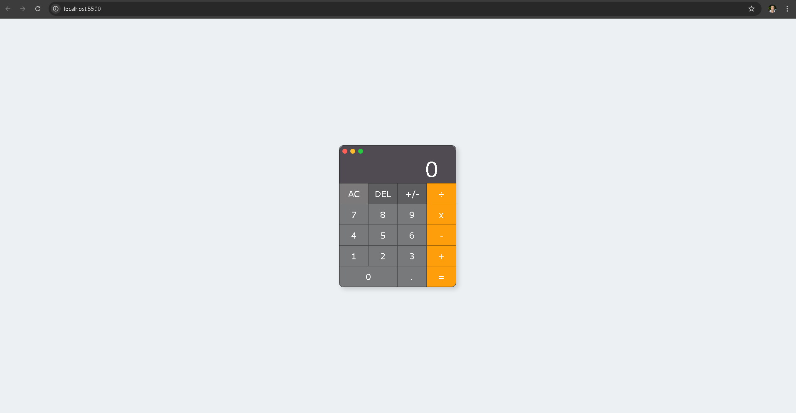

# 🧮 Calculadora JS

## 📖 Descrição

A **Calculadora JS** é um projeto desenvolvido como estudo para relembrar conceitos de **JavaScript puro**, **HTML5** e **CSS3**, após muito tempo utilizando apenas bibliotecas modernas como o ReactJS.  

O objetivo foi reforçar a lógica de programação, manipulação de DOM e boas práticas de estilização com CSS Grid e variáveis CSS.  

---

## 🎮 Preview  



👉 [Acessar o projeto na Vercel](https://projeto-dc-calculadora.vercel.app/)

[](https://projeto-dc-calculadora.vercel.app/)

---

## ⚡ Funcionalidades

- Exibição de valor digitado no visor.  
- Operações básicas: adição (+), subtração (−), multiplicação (×) e divisão (÷).  
- Botão **AC** para limpar o visor.  
- Botão **DEL** para apagar último caractere digitado.  
- Botão **+/-** para inverter o sinal do número.  
- Validação para impedir múltiplos símbolos seguidos.  
- Interface responsiva com **CSS Grid**.  
- Feedback visual nos botões (efeito hover).  

---

## 📚 Conceitos praticados

- Manipulação de DOM com `addEventListener`.  
- Estruturação de lógica usando funções puras.  
- Validação de entradas e tratamento de erros.  
- Uso de **variáveis CSS** para customização de layout.  
- Testes manuais com `console.log()` para depuração.  

---

## 🛠️ Tecnologias

- **JavaScript** 
- **HTML5**  
- **CSS3**  

---

## 🚀 Como usar

1. Clone o repositório:

	```bash
	git clone https://github.com/Matheus-TecDev/Projeto-DC-Letreco.git

    
2. Acesse a pasta do projeto:
    
    ```bash
    cd letreco

    
3. Abra o arquivo `index.html` no navegador
    
    ```bash
    *(ou utilize a extensão **Live Server** do VS Code para melhor experiência).*
    

---

🤝 Contribuição
Sugestões de melhorias são muito bem-vindas!

Abra uma issue para relatar bugs ou propor ideias.

Envie um Pull Request com suas contribuições.

---

📌 Roadmap (versões futuras)
Adicionar suporte para operações avançadas (potência, raiz, porcentagem).

Melhorar a responsividade em dispositivos móveis.

Implementar histórico de cálculos.

Criar versão com tema dark/light.

---

## 👨‍💻 Autores

- [Matheus Freire](https://github.com/Matheus-TecDev)  
- [LinkedIn](https://www.linkedin.com/in/matheus-freire-martins-da-costa-318622376/)  

📫 Contato: matheus.tecnodev@gmail.com
